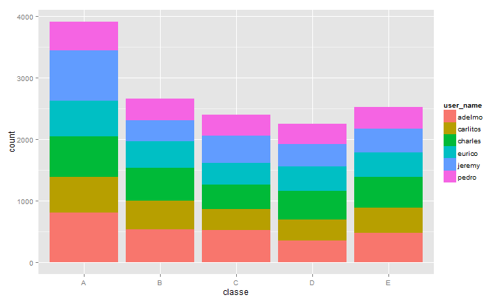
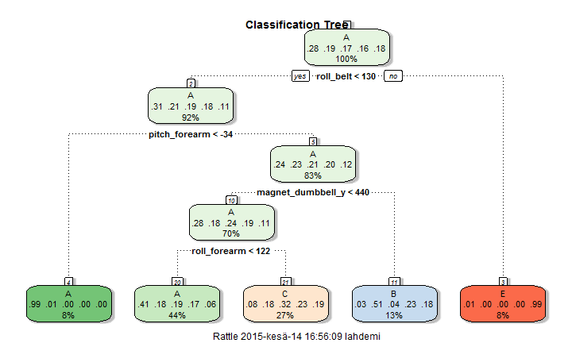

##Background

Using devices such as Jawbone Up, Nike FuelBand, and Fitbit it is now possible to collect a large amount of data about personal activity relatively inexpensively. These type of devices are part of the quantified self movement - a group of enthusiasts who take measurements about themselves regularly to improve their health, to find patterns in their behavior, or because they are tech geeks. One thing that people regularly do is quantify how much of a particular activity they do, but they rarely quantify how well they do it. In this project, your goal will be to use data from accelerometers on the belt, forearm, arm, and dumbell of 6 participants. They were asked to perform barbell lifts correctly and incorrectly in 5 different ways. 
More information is available from the website here: http://groupware.les.inf.puc-rio.br/har (see the section on the Weight Lifting Exercise Dataset).

##Summary

The goal of this project was to predict the manner in which they did the exercise. This is the "classe" variable in the training set.

First we needed to download the data and the split it to training and testing sets. We made also some exploratory analysis to find how the data looks and where to start modeling. Classification tree was first attempt and then continued with Random Forest Model which was very accurate (about 99%).

Last thing was to test the model against to testing data and make answer files for project submission.


##Data Processing

The data for this project come from this source: http://groupware.les.inf.puc-rio.br/har.
At first we need to download the dataset and process it in R.
We'll split the training data to 70% training and 30% testing sets.


```r
require(caret)

#Download data
download.file("http://d396qusza40orc.cloudfront.net/predmachlearn/pml-training.csv", 
              destfile = "./pml-training.csv")
download.file("http://d396qusza40orc.cloudfront.net/predmachlearn/pml-testing.csv", 
              destfile = "./pml-testing.csv")

#Load data to R
rawTraining <- read.csv("./pml-training.csv", na.strings=c("NA",""), strip.white=T)
#rawTesting <- read.csv("./pml-testing.csv", na.strings=c("NA",""), strip.white=T)

##Fix NA's
isNA <- apply(rawTraining, 2, function(x) { sum(is.na(x)) })
data <- subset(rawTraining[, which(isNA == 0)], 
                    select=-c(X, new_window, num_window, raw_timestamp_part_1, raw_timestamp_part_2, cvtd_timestamp))

#Make training and test sets
inTrain <- createDataPartition(data$classe, p=0.7, list=F)
training <- data[inTrain,]
testing <- data[-inTrain,]
```


## Exploratory Analysis

At first we like to see some distribution information about the dataset.

###Summary


```r
require(knitr)
set.seed(666)

summary(training)
```

    user_name      roll_belt        pitch_belt          yaw_belt      
 adelmo  :2692   Min.   :-28.90   Min.   :-55.8000   Min.   :-180.00  
 carlitos:2151   1st Qu.:  1.10   1st Qu.:  1.8900   1st Qu.: -88.30  
 charles :2529   Median :114.00   Median :  5.3100   Median : -12.20  
 eurico  :2156   Mean   : 64.65   Mean   :  0.4965   Mean   : -11.34  
 jeremy  :2375   3rd Qu.:123.00   3rd Qu.: 15.5000   3rd Qu.:  10.20  
 pedro   :1834   Max.   :162.00   Max.   : 60.3000   Max.   : 179.00  
 total_accel_belt  gyros_belt_x        gyros_belt_y      gyros_belt_z   
 Min.   : 0.00    Min.   :-1.000000   Min.   :-0.6400   Min.   :-1.460  
 1st Qu.: 3.00    1st Qu.:-0.030000   1st Qu.: 0.0000   1st Qu.:-0.200  
 Median :17.00    Median : 0.030000   Median : 0.0200   Median :-0.110  
 Mean   :11.35    Mean   :-0.006547   Mean   : 0.0395   Mean   :-0.132  
 3rd Qu.:18.00    3rd Qu.: 0.110000   3rd Qu.: 0.1100   3rd Qu.:-0.020  
 Max.   :29.00    Max.   : 2.220000   Max.   : 0.6300   Max.   : 1.620  
  accel_belt_x       accel_belt_y     accel_belt_z     magnet_belt_x   
 Min.   :-120.000   Min.   :-69.00   Min.   :-275.00   Min.   :-52.00  
 1st Qu.: -21.000   1st Qu.:  3.00   1st Qu.:-162.00   1st Qu.:  9.00  
 Median : -15.000   Median : 36.00   Median :-153.00   Median : 34.00  
 Mean   :  -5.786   Mean   : 30.35   Mean   : -73.08   Mean   : 55.21  
 3rd Qu.:  -5.000   3rd Qu.: 61.00   3rd Qu.:  27.00   3rd Qu.: 59.00  
 Max.   :  85.000   Max.   :164.00   Max.   : 105.00   Max.   :485.00  
 magnet_belt_y   magnet_belt_z       roll_arm         pitch_arm      
 Min.   :359.0   Min.   :-623.0   Min.   :-180.00   Min.   :-88.800  
 1st Qu.:581.0   1st Qu.:-375.0   1st Qu.: -32.70   1st Qu.:-26.200  
 Median :601.0   Median :-320.0   Median :   0.00   Median :  0.000  
 Mean   :593.4   Mean   :-345.8   Mean   :  17.78   Mean   : -5.094  
 3rd Qu.:610.0   3rd Qu.:-306.0   3rd Qu.:  77.40   3rd Qu.: 10.700  
 Max.   :673.0   Max.   : 293.0   Max.   : 179.00   Max.   : 88.500  
    yaw_arm          total_accel_arm  gyros_arm_x        gyros_arm_y    
 Min.   :-180.0000   Min.   : 1.00   Min.   :-6.37000   Min.   :-3.400  
 1st Qu.: -42.9000   1st Qu.:17.00   1st Qu.:-1.38000   1st Qu.:-0.790  
 Median :   0.0000   Median :27.00   Median : 0.08000   Median :-0.240  
 Mean   :  -0.6369   Mean   :25.48   Mean   : 0.02774   Mean   :-0.254  
 3rd Qu.:  45.4000   3rd Qu.:33.00   3rd Qu.: 1.57000   3rd Qu.: 0.160  
 Max.   : 180.0000   Max.   :66.00   Max.   : 4.87000   Max.   : 2.840  
  gyros_arm_z       accel_arm_x       accel_arm_y       accel_arm_z     
 Min.   :-2.3300   Min.   :-404.00   Min.   :-318.00   Min.   :-636.00  
 1st Qu.:-0.0700   1st Qu.:-240.00   1st Qu.: -54.00   1st Qu.:-144.00  
 Median : 0.2300   Median : -41.00   Median :  13.00   Median : -47.00  
 Mean   : 0.2702   Mean   : -58.88   Mean   :  32.08   Mean   : -71.22  
 3rd Qu.: 0.7200   3rd Qu.:  84.00   3rd Qu.: 139.00   3rd Qu.:  24.00  
 Max.   : 3.0200   Max.   : 437.00   Max.   : 308.00   Max.   : 292.00  
  magnet_arm_x     magnet_arm_y   magnet_arm_z    roll_dumbbell    
 Min.   :-584.0   Min.   :-386   Min.   :-597.0   Min.   :-153.71  
 1st Qu.:-297.0   1st Qu.: -12   1st Qu.: 123.0   1st Qu.: -19.29  
 Median : 297.0   Median : 198   Median : 442.0   Median :  48.06  
 Mean   : 195.3   Mean   : 155   Mean   : 304.3   Mean   :  23.53  
 3rd Qu.: 639.0   3rd Qu.: 322   3rd Qu.: 544.0   3rd Qu.:  67.66  
 Max.   : 780.0   Max.   : 583   Max.   : 694.0   Max.   : 153.55  
 pitch_dumbbell     yaw_dumbbell      total_accel_dumbbell
 Min.   :-149.59   Min.   :-150.871   Min.   : 0.00       
 1st Qu.: -40.51   1st Qu.: -77.553   1st Qu.: 4.00       
 Median : -20.83   Median :  -2.623   Median :10.00       
 Mean   : -10.70   Mean   :   1.999   Mean   :13.69       
 3rd Qu.:  17.71   3rd Qu.:  79.595   3rd Qu.:19.00       
 Max.   : 149.40   Max.   : 154.952   Max.   :58.00       
 gyros_dumbbell_x    gyros_dumbbell_y  gyros_dumbbell_z  
 Min.   :-204.0000   Min.   :-2.1000   Min.   : -2.3800  
 1st Qu.:  -0.0300   1st Qu.:-0.1400   1st Qu.: -0.3100  
 Median :   0.1300   Median : 0.0300   Median : -0.1300  
 Mean   :   0.1561   Mean   : 0.0464   Mean   : -0.1221  
 3rd Qu.:   0.3500   3rd Qu.: 0.2100   3rd Qu.:  0.0300  
 Max.   :   2.2200   Max.   :52.0000   Max.   :317.0000  
 accel_dumbbell_x  accel_dumbbell_y  accel_dumbbell_z  magnet_dumbbell_x
 Min.   :-419.00   Min.   :-189.00   Min.   :-319.00   Min.   :-638.0   
 1st Qu.: -50.00   1st Qu.:  -9.00   1st Qu.:-141.00   1st Qu.:-535.0   
 Median :  -8.00   Median :  41.00   Median :  -1.00   Median :-479.0   
 Mean   : -28.45   Mean   :  52.36   Mean   : -38.03   Mean   :-327.6   
 3rd Qu.:  11.00   3rd Qu.: 111.00   3rd Qu.:  38.00   3rd Qu.:-302.0   
 Max.   : 234.00   Max.   : 315.00   Max.   : 318.00   Max.   : 592.0   
 magnet_dumbbell_y magnet_dumbbell_z  roll_forearm     pitch_forearm   
 Min.   :-742      Min.   :-262.00   Min.   :-180.00   Min.   :-72.50  
 1st Qu.: 231      1st Qu.: -46.00   1st Qu.:  -1.11   1st Qu.:  0.00  
 Median : 311      Median :  13.00   Median :  21.50   Median :  9.44  
 Mean   : 221      Mean   :  45.57   Mean   :  33.43   Mean   : 10.74  
 3rd Qu.: 390      3rd Qu.:  95.00   3rd Qu.: 140.00   3rd Qu.: 28.60  
 Max.   : 633      Max.   : 451.00   Max.   : 180.00   Max.   : 89.80  
  yaw_forearm      total_accel_forearm gyros_forearm_x   
 Min.   :-180.00   Min.   :  0.00      Min.   :-22.0000  
 1st Qu.: -70.80   1st Qu.: 29.00      1st Qu.: -0.2100  
 Median :   0.00   Median : 36.00      Median :  0.0500  
 Mean   :  18.26   Mean   : 34.64      Mean   :  0.1573  
 3rd Qu.: 110.00   3rd Qu.: 41.00      3rd Qu.:  0.5600  
 Max.   : 180.00   Max.   :108.00      Max.   :  3.9700  
 gyros_forearm_y    gyros_forearm_z    accel_forearm_x   accel_forearm_y 
 Min.   : -6.6500   Min.   : -8.0900   Min.   :-498.00   Min.   :-632.0  
 1st Qu.: -1.4800   1st Qu.: -0.1800   1st Qu.:-178.00   1st Qu.:  57.0  
 Median :  0.0300   Median :  0.0800   Median : -57.00   Median : 200.0  
 Mean   :  0.0756   Mean   :  0.1568   Mean   : -61.78   Mean   : 163.4  
 3rd Qu.:  1.6100   3rd Qu.:  0.4900   3rd Qu.:  76.00   3rd Qu.: 312.0  
 Max.   :311.0000   Max.   :231.0000   Max.   : 375.00   Max.   : 923.0  
 accel_forearm_z   magnet_forearm_x  magnet_forearm_y magnet_forearm_z
 Min.   :-391.00   Min.   :-1280.0   Min.   :-896.0   Min.   :-966    
 1st Qu.:-182.00   1st Qu.: -617.0   1st Qu.:  12.0   1st Qu.: 192    
 Median : -38.00   Median : -377.0   Median : 593.0   Median : 510    
 Mean   : -54.72   Mean   : -313.1   Mean   : 383.1   Mean   : 393    
 3rd Qu.:  27.00   3rd Qu.:  -69.0   3rd Qu.: 736.0   3rd Qu.: 653    
 Max.   : 291.00   Max.   :  672.0   Max.   :1480.0   Max.   :1090    
 classe  
 A:3906  
 B:2658  
 C:2396  
 D:2252  
 E:2525  
         

Please see the distribution plot in Appendix - Figure 1.


###Classification Tree

Then we'll try to analyse the traning set with the classification tree.


```r
require(rattle)
require(rpart.plot)

modelRpart <- train(classe ~., method="rpart",data=training)
```

Please see the classification tree plot in Appendix - Figure 2.


##Random Forest Model

Next we'll train a Random Forest model on the training set.


```r
require(randomForest)

modelRandomForest <- randomForest(classe~.,data=training)
modelRandomForest
```


Call:
 randomForest(formula = classe ~ ., data = training) 
               Type of random forest: classification
                     Number of trees: 500
No. of variables tried at each split: 7

        OOB estimate of  error rate: 0.54%
Confusion matrix:
     A    B    C    D    E class.error
A 3901    4    0    1    0 0.001280082
B   12 2642    4    0    0 0.006019564
C    0   21 2372    3    0 0.010016694
D    0    0   23 2227    2 0.011101243
E    0    0    1    3 2521 0.001584158


##Testing the Model

The Random Forest Model seems to be very accurate on training set. We'll test it against the testing set.  


```r
pred <- predict(modelRandomForest, testing)
confusionMatrix(testing$classe, pred)
```

Confusion Matrix and Statistics

          Reference
Prediction    A    B    C    D    E
         A 1672    2    0    0    0
         B    6 1130    3    0    0
         C    0    7 1018    1    0
         D    0    0   16  946    2
         E    0    0    0    2 1080

Overall Statistics
                                         
               Accuracy : 0.9934         
                 95% CI : (0.991, 0.9953)
    No Information Rate : 0.2851         
    P-Value [Acc > NIR] : < 2.2e-16      
                                         
                  Kappa : 0.9916         
 Mcnemar's Test P-Value : NA             

Statistics by Class:

                     Class: A Class: B Class: C Class: D Class: E
Sensitivity            0.9964   0.9921   0.9817   0.9968   0.9982
Specificity            0.9995   0.9981   0.9983   0.9964   0.9996
Pos Pred Value         0.9988   0.9921   0.9922   0.9813   0.9982
Neg Pred Value         0.9986   0.9981   0.9961   0.9994   0.9996
Prevalence             0.2851   0.1935   0.1762   0.1613   0.1839
Detection Rate         0.2841   0.1920   0.1730   0.1607   0.1835
Detection Prevalence   0.2845   0.1935   0.1743   0.1638   0.1839
Balanced Accuracy      0.9980   0.9951   0.9900   0.9966   0.9989

The model is 0.993373 accurate against our testing set.
Confusion matrix also shows this.

Please see the submission code in Appendix - Code 1. 
It will show the steps to test the testing data and how to make the answer files.

##Appendix

### Code 1: Submission Script

```r
pml_write_files = function(x){
  n = length(x)
  for(i in 1:n){
    filename = paste0("problem_id_",i,".txt")
    write.table(x[i],file=filename,quote=FALSE,row.names=FALSE,col.names=FALSE)
  }
}

rawTesting <- read.csv("./pml-testing.csv", na.strings=c("NA",""), strip.white=T)
predictions <- predict(modelRandomForest, rawTesting)

pml_write_files(predictions)
```


### Figure 1: Count of Users per Classe in Training Set

```r
require(ggplot2)
qplot(classe, data=training, fill=user_name)
```

 

### Figure 2: Classification Tree of Training Set

```r
fancyRpartPlot(modelRpart$finalModel, main="Classification Tree")
```

 
